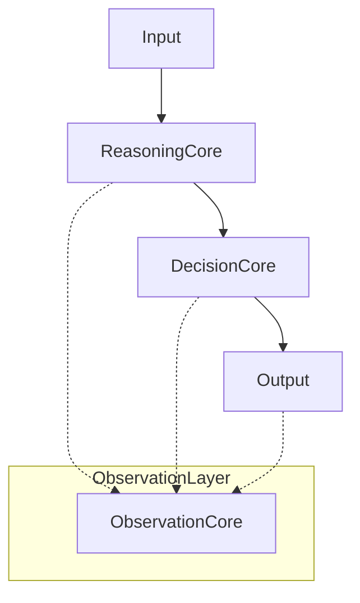

# ObservationCore Specification (Draft v1.0)
# 観察Core 仕様書 (v1.0)

## 1. Purpose (目的)

**English:**
ObservationCore is the central component for observing the behavior of the BrainModel (Inference, Decision, Expression, Context) and externalizing its state as "description" rather than "evaluation".
It does NOT improve performance, make judgments, or alter inference. Its sole purpose is to verify whether the BrainModel is in a state where it can grow soundly.

**Japanese:**
観察Coreは、BrainModel の 推論・判断・表現・文脈の振る舞いを観測し、その状態を「評価ではなく記述」として外部化するための中核コンポーネントである。
性能を上げない、判断を下さない、推論を変更しない。目的はただ一つ：BrainModel が“健全に成長可能な状態にあるか”を、将来にわたって確認可能にすることである。

---

## 2. Architecture (位置づけ)

**Logical Position:**
Independent layer observing the process across:
`Input` -> `Reasoning Core` -> `Decision Core` -> `Action / Output`

**Principles (原則):**
1. Do not interrupt the inference flow. (推論フローに割り込まない)
2. Do not have control authority. (制御権限を持たない)
3. System functions regardless of ObservationCore's existence. (存在しても、存在しなくてもシステムは動作する)

---

## 3. Observation Unit (観測単位)

**Unit:** Inference Event (1回の推論を1イベントとする)

**Content:**
*   Input (Serialized/Normalized)
*   Representation Format (AST, Holographic, etc.)
*   Recall Status (Existence, Success Degree)
*   Inference Path (Abstract Level)
*   Decision Branch (Accept, Review, Reject)
*   Uncertainty Metrics (Entropy, Confidence, etc.)
*   Referenced Memory/Experience
*   Context Information (Authority, Mode, Environment)

---

## 4. Responsibilities (責務)

### 4.1 Observation (観測)
*   Receive Inference Events.
*   Do NOT change internal structure.
*   Record failures, interruptions, and uncertain states.
*   **Prohibited:** Altering results, treating log loss as errors.

### 4.2 State Evaluation (状態評価)
*   Do NOT make Yes/No judgments.
*   Assign **State Labels** only.

**Target Categories:**
*   **Structural Health:** Fixed inference? Hollow recall? Failures? Decision instability?
*   **Ethical/Normative Risk:** High risk contact? Insufficient context? Dogmatic uncertainty?

### 4.3 State Emission (状態出力)
*   Output only "State".
*   Structured and readable by humans/modules.
*   Not a control command.

**Example States:**
*   `STRUCTURALLY_STABLE`
*   `STRUCTURAL_DRIFT_DETECTED`
*   `RECALL_UNDERUTILIZED`
*   `HIGH_UNCERTAINTY`
*   `ETHICALLY_SENSITIVE`
*   `CONTEXT_INSUFFICIENT`

---

## 5. Non-Responsibilities (非責務)
ObservationCore explicitly DOES NOT:
*   Judge Right/Wrong of inference results.
*   Permit/Reject actions.
*   Optimize/Learn/Correct.
*   Preach ethics or generate explanations.
*   Respond directly to users.

It only "Watches" and does "Not Speak".

---

## 6. MVP Requirements (初期実装要件)
1.  Receive `InferenceEvent`. (Inference Event を受け取れる)
2.  Assign minimum `StateLabel`. (最低限の状態ラベルを付与できる)
3.  Save/Reference externally. (外部に保存・参照できる)

**Out of Scope for MVP:**
*   Automated response.
*   Automated optimization.
*   Stop processing.
*   Advanced ethical reasoning.
